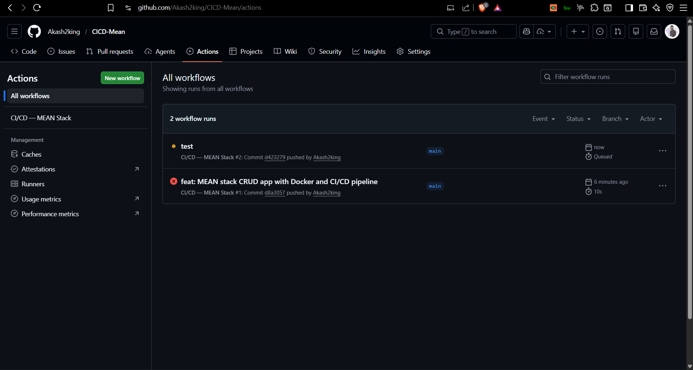

# MEAN Stack CRUD App — Tutorials Manager

A full-stack CRUD application built with **MongoDB, Express, Angular 15, and Node.js**.  
It lets you create, read, update, delete, and search tutorials.  
It includes a **CI/CD pipeline** using **GitHub Actions**, **Docker**, **Docker Hub**, and **AWS EC2**.

---

## Screenshots

### App — Tutorials List


### App — Add Tutorial
 

### App — Tutorial Details


### GitHub Actions — All Workflow Runs



### GitHub Actions — Pipeline Running


### GitHub Actions — Pipeline Success


### EC2 — Containers Running


### GitHub — Secrets Added


---

## Table of Contents

1. [Project Structure](#1-project-structure)
2. [What the App Does](#2-what-the-app-does)
3. [Tech Stack](#3-tech-stack)
4. [Run Locally Without Docker](#4-run-locally-without-docker)
5. [Run Locally With Docker](#5-run-locally-with-docker)
6. [CI/CD Pipeline Overview](#6-cicd-pipeline-overview)
7. [Step-by-Step: Docker Hub Setup](#7-step-by-step-docker-hub-setup)
8. [Step-by-Step: AWS EC2 Setup](#8-step-by-step-aws-ec2-setup)
9. [Step-by-Step: GitHub Secrets Setup](#9-step-by-step-github-secrets-setup)
10. [Step-by-Step: Push Code and Trigger Pipeline](#10-step-by-step-push-code-and-trigger-pipeline)
11. [Verify Deployment](#11-verify-deployment)
12. [Useful Commands](#12-useful-commands)
13. [Project Files Explained](#13-project-files-explained)
14. [Troubleshooting](#14-troubleshooting)

---

## 1. Project Structure

```
crud-dd-task-mean-app/
│
├── .github/
│   └── workflows/
│       └── ci-cd.yml              ← GitHub Actions CI/CD pipeline (2 jobs)
│
├── backend/                       ← Node.js + Express REST API
│   ├── Dockerfile                 ← Multi-stage Docker build
│   ├── .dockerignore
│   ├── .gitignore
│   ├── server.js                  ← App entry point
│   ├── package.json
│   ├── package-lock.json          ← Required for Docker build (do not delete)
│   └── app/
│       ├── config/db.config.js    ← MongoDB connection (reads MONGO_URI env var)
│       ├── controllers/tutorial.controller.js
│       ├── models/tutorial.model.js
│       └── routes/turorial.routes.js
│
├── frontend/                      ← Angular 15 app
│   ├── Dockerfile                 ← Build Angular → serve with Nginx
│   ├── .dockerignore
│   ├── nginx.conf                 ← Serves Angular + proxies /api/* to backend
│   └── src/
│       ├── environments/
│       │   ├── environment.ts         ← dev  (API: http://localhost:8080/api)
│       │   └── environment.prod.ts    ← prod (API: /api  — nginx handles proxy)
│       └── app/
│           ├── components/
│           ├── services/tutorial.service.ts
│           └── models/tutorial.model.ts
│
├── docker-compose.yml             ← Local development stack
├── docker-compose.prod.yml        ← Production stack on EC2
├── .env.example                   ← Environment variable template
└── scripts/
    └── setup-ec2.sh               ← One-time EC2 bootstrap script
```

---

## 2. What the App Does

| Feature | Details |
|---|---|
| Add Tutorial | Create a new tutorial with title and description |
| View All | List all tutorials |
| Search | Search tutorials by title |
| View One | Click a tutorial to see its full details |
| Edit | Update the title, description, or published status |
| Publish / Unpublish | Toggle the published status |
| Delete One | Remove a single tutorial |
| Delete All | Remove all tutorials at once |

The backend exposes a REST API at `/api/tutorials` with full CRUD endpoints.

---

## 3. Tech Stack

| Layer | Technology |
|---|---|
| Database | MongoDB 6.0 |
| Backend | Node.js 18 + Express 4 + Helmet + Compression |
| Frontend | Angular 15 + Bootstrap 4 |
| Web Server | Nginx 1.25 (serves Angular + reverse proxies API) |
| Containerization | Docker + Docker Compose |
| CI/CD | GitHub Actions |
| Image Registry | Docker Hub |
| Hosting | AWS EC2 (Ubuntu 22.04) |

---

## 4. Run Locally Without Docker

### Prerequisites
- Node.js 18+
- MongoDB running locally on port 27017

### Step 1 — Start the Backend

```bash
cd backend
npm install
node server.js
```

Backend runs at: `http://localhost:8080`

### Step 2 — Start the Frontend

Open a new terminal:

```bash
cd frontend
npm install
ng serve --port 8081
```

Frontend runs at: `http://localhost:8081`

> The frontend calls the backend at `http://localhost:8080/api` by default (set in `environment.ts`).

---

## 5. Run Locally With Docker

### Prerequisites
- Docker Desktop installed and running

### Step 1 — Copy the environment file

```bash
# Windows
copy .env.example .env

# Mac / Linux
cp .env.example .env
```

The default values in `.env` work out of the box for local Docker.

### Step 2 — Build and start all containers

```bash
docker compose up --build
```

This starts 3 containers:
- `mongo` — MongoDB database
- `backend` — Express API
- `frontend` — Angular app served by Nginx on port 80

### Step 3 — Open the app

Go to: `http://localhost`


### Stop the app

```bash
docker compose down
```

To also delete the database volume:

```bash
docker compose down -v
```

---

## 6. CI/CD Pipeline Overview

The pipeline runs automatically every time you push to `main` or `master`.  
It has **2 jobs** that run in order:

```
Push code to GitHub (main / master)
            │
            ▼
   ┌─────────────────────────────────┐
   │  Job 1: Build and Push          │
   │  ─────────────────────────────  │
   │  docker build backend           │
   │  docker push → Docker Hub       │
   │  docker build frontend          │
   │  docker push → Docker Hub       │
   └──────────────┬──────────────────┘
                  │  must pass
                  ▼
   ┌─────────────────────────────────┐
   │  Job 2: Deploy to EC2           │
   │  ─────────────────────────────  │
   │  SCP compose file to EC2        │
   │  SSH in → docker login          │
   │  write .env file                │
   │  docker compose pull            │
   │  docker compose up -d           │
   │  docker compose ps              │
   │  docker logout                  │
   │  docker image prune -a -f       │
   └─────────────────────────────────┘
```


---

## 7. Step-by-Step: Docker Hub Setup

### Step 1 — Create a Docker Hub account

Go to [https://hub.docker.com](https://hub.docker.com) and sign up (free).


### Step 2 — Create two repositories

1. Click **Repositories** → **Create Repository**
2. Name: `mean-backend` → Visibility: **Public** → **Create**
3. Repeat → Name: `mean-frontend` → Visibility: **Public** → **Create**

You will now have:
- `your-username/mean-backend`
- `your-username/mean-frontend`


### Step 3 — Create an Access Token

> Never use your Docker Hub password in GitHub Actions — always use a token.

1. Click your profile picture → **Account Settings**
2. Click **Security** → **New Access Token**
3. Name: `github-actions`
4. Permissions: **Read, Write, Delete**
5. Click **Generate**
6. **Copy the token immediately** — you cannot see it again


---

## 8. Step-by-Step: AWS EC2 Setup

### Step 1 — Launch an EC2 instance

1. Go to **AWS Console** → **EC2** → **Launch Instance**
2. Name: `mean-stack-server`
3. AMI: **Ubuntu Server 22.04 LTS**
4. Instance type: `t3.small` (needs at least 2 GB RAM for MongoDB)
5. Key pair: **Create new key pair** → Download the `.pem` file → keep it safe
6. Network settings → **Allow SSH (port 22)** from your IP
7. Network settings → **Allow HTTP (port 80)** from anywhere (`0.0.0.0/0`)
8. Click **Launch Instance**

> 📸 _Add screenshot of the EC2 Launch Instance page_

### Step 2 — Connect to the EC2 instance

On Windows (PowerShell):

```powershell
ssh -i "your-key.pem" ubuntu@my-ec2-public-ip
```


### Step 3 — Run the setup script

Once connected to EC2, run:

```bash
curl -fsSL https://raw.githubusercontent.com/Akash2king/CICD-Mean/main/scripts/setup-ec2.sh | bash
```

This installs Docker, Docker Compose, AWS CLI, and creates the `~/app` directory.

### Step 4 — Log out and back in

Required for Docker to work without `sudo`:

```bash
exit
ssh -i "your-key.pem" ubuntu@your-ec2-public-ip
```

### Step 5 — Verify Docker is installed

```bash
docker --version
docker compose version
```


---

## 9. Step-by-Step: GitHub Secrets Setup

These secrets are encrypted and injected into the pipeline at runtime. They are **never visible** in logs.

### Step 1 — Go to repository secrets

1. Open your GitHub repository
2. Click **Settings** → **Secrets and variables** → **Actions**
3. Click **New repository secret** for each secret below


### Step 2 — Add all 7 secrets

| Secret Name | Value | Where to get it |
|---|---|---|
| `DOCKERHUB_USERNAME` | Your Docker Hub username | Your Docker Hub login name |
| `DOCKERHUB_TOKEN` | The access token from Step 7.3 | Docker Hub → Account Settings → Security |
| `EC2_HOST` | Your EC2 public IP | AWS Console → EC2 → Instances → Public IPv4 address |
| `EC2_USER` | `ubuntu` | Default username for Ubuntu AMI |
| `EC2_SSH_KEY` | Full contents of your `.pem` file | Open `.pem` in Notepad, copy everything including the `-----BEGIN` and `-----END` lines |
| `MONGO_URI` | `mongodb://mongo:27017/dd_db` | Use as-is for self-hosted MongoDB on EC2 |
| `CORS_ORIGIN` | `http://your-ec2-public-ip` | Your EC2 public IP with `http://` prefix, no trailing slash |

### Step 3 — Confirm all 7 secrets are listed

You should see all 7 names listed (values are always hidden).


---

## 10. Step-by-Step: Push Code and Trigger Pipeline

### Step 1 — Initialize git (if not done yet)

```bash
git init
git add .
git commit -m "Initial commit"
```

### Step 2 — Connect to GitHub and push

```bash
git remote add origin https://github.com/Akash2king/CICD-Mean.git
git branch -M main
git push -u origin main
```

### Step 3 — Watch the pipeline

1. Go to your GitHub repository
2. Click the **Actions** tab
3. Click **CI/CD — MEAN Stack** to open the running pipeline
4. Click each job to see live logs


### Step 4 — What a successful run looks like

```
✅ Build and Push  — backend and frontend images pushed to Docker Hub
✅ Deploy to EC2   — containers restarted, old images cleaned up
```


---

## 11. Verify Deployment

### Open the app in a browser

```
http://your-ec2-public-ip
```


### Check container status on EC2

SSH into EC2 and run:

```bash
cd ~/app
docker compose -f docker-compose.prod.yml ps
```

All 3 containers should show `running (healthy)`:

```
NAME        IMAGE                              STATUS
mongo       mongo:6.0                          running (healthy)
backend     your-username/mean-backend:latest  running (healthy)
frontend    your-username/mean-frontend:latest running (healthy)
```


### Test the backend API directly

```bash
curl http://localhost/api/
```

Expected response: `{"message":"Welcome to the Tutorials API."}`

### Check Docker Hub for pushed images

Go to `https://hub.docker.com/u/your-username` and you should see both images with a recent **Last pushed** timestamp.


---

---

## 13. Project Files Explained

| File | What it does |
|---|---|
| `backend/Dockerfile` | Two-stage build: Stage 1 installs only production dependencies. Stage 2 creates a small image with a non-root user, tini for signal handling, and a health check. |
| `backend/package-lock.json` | Locks exact dependency versions. Required by `npm ci` inside Docker. Do not delete or add to `.gitignore`. |
| `frontend/Dockerfile` | Two-stage build: Stage 1 compiles Angular with AOT optimisation. Stage 2 serves the static files with Nginx (~30 MB final image). |
| `frontend/nginx.conf` | Serves Angular static files, proxies all `/api/*` requests to the backend container, enables gzip compression, sets security headers, handles Angular client-side routing. |
| `frontend/src/environments/environment.ts` | API URL for local development: `http://localhost:8080/api` |
| `frontend/src/environments/environment.prod.ts` | API URL for production: `/api` (nginx proxies it to the backend container) |
| `docker-compose.yml` | Local dev stack — builds images from source, exposes ports, mounts volumes. |
| `docker-compose.prod.yml` | Production stack on EC2 — pulls images from Docker Hub, sets memory limits, configures health checks and log rotation. |
| `.env.example` | Template for environment variables. Copy to `.env` for local use. Never commit `.env`. |
| `.github/workflows/ci-cd.yml` | The CI/CD pipeline: Job 1 builds and pushes images to Docker Hub. Job 2 SSHs into EC2 and deploys. |
| `scripts/setup-ec2.sh` | One-time bootstrap script for a fresh EC2 instance — installs Docker, Docker Compose, and AWS CLI. |

---

## 14. Mistakes I Made — and How I Fixed Them

This section isn't just a dry troubleshooting guide. These are real mistakes I ran into while building and deploying this project for the first time. Each one taught me something I won't forget.

---

### "npm ci failed — exit code 1" — The Missing Lock File

The very first time I pushed my code and watched the GitHub Actions pipeline run, it failed almost immediately at the **"Build and push backend image"** step. The error was blunt: `npm ci failed — exit code 1`.

I stared at it for a while before I realized what happened — I had never committed `backend/package-lock.json`. I ran `npm install` locally and just moved on without thinking about the lock file. But `npm ci` (which the Docker build uses) requires it to exist. Without it, the build has nothing to work with.

The fix was simple once I understood the cause:

```bash
cd backend
npm install
git add package-lock.json
git commit -m "add package-lock.json"
git push
```

**Lesson:** Always commit your lock files. `npm ci` is strict by design — it ensures reproducible installs across environments.

---

### Docker Hub Push Failed — Wrong Token Permissions

Once the workflow file was valid and the images were building, the push to Docker Hub failed. I had created a Docker Hub access token, added it as a secret, and assumed it would just work.

It didn't — because I had generated the token with **Read-only** permissions. The pipeline needs to push images, so the token must have **Read, Write, Delete** permissions.

I went back to Docker Hub, regenerated the token with the right permissions, updated the `DOCKERHUB_TOKEN` secret in GitHub, and the push worked on the next run.

**Lesson:** Pay attention to permission scopes when generating tokens. A read-only token will silently fail on push.

---

