# MEAN Stack CRUD App — Tutorials Manager

A full-stack CRUD application built with **MongoDB, Express, Angular 15, and Node.js**.  
It lets you create, read, update, delete, and search tutorials.  
It is deployed automatically using a **CI/CD pipeline** built with **GitHub Actions**, **Docker**, **Docker Hub**, and **AWS EC2**.

# Click Here to see The [Deployed Site 🌐](http://ec2-3-83-149-83.compute-1.amazonaws.com/)

---

## Screenshots

### App — Tutorials List

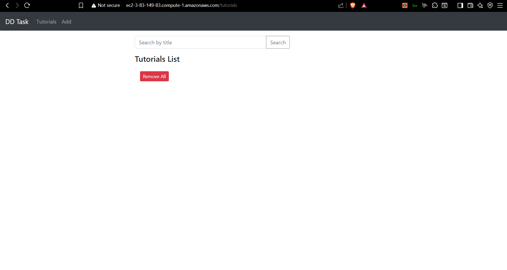

### App — Add Tutorial
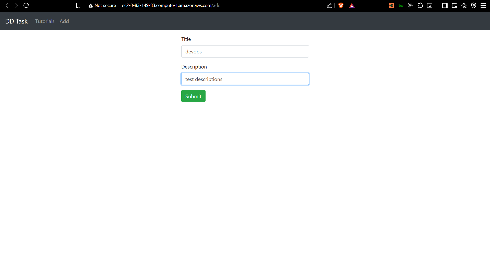 

### App — Tutorial Details
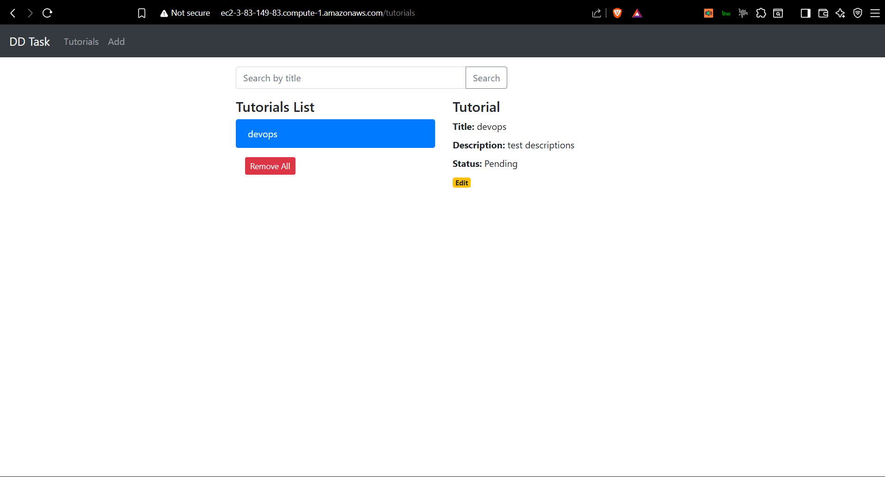

### EC2 — Containers Running

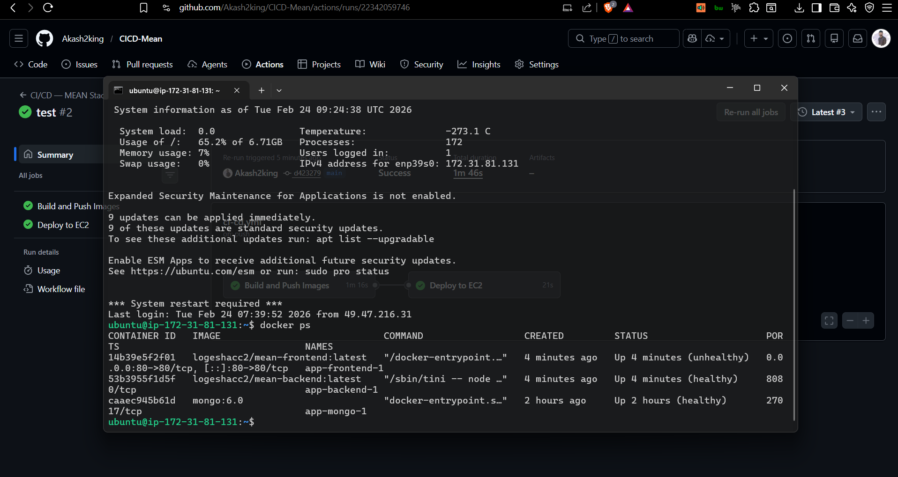

---

## Table of Contents

1. [Project Structure](#1-project-structure)
2. [What the App Does](#2-what-the-app-does)
3. [Tech Stack](#3-tech-stack)
4. [CI/CD Pipeline Overview](#4-cicd-pipeline-overview)
5. [Step-by-Step: Docker Hub Setup](#5-step-by-step-docker-hub-setup)
6. [Step-by-Step: AWS EC2 Setup](#6-step-by-step-aws-ec2-setup)
7. [Step-by-Step: GitHub Secrets Setup](#7-step-by-step-github-secrets-setup)
8. [Step-by-Step: Push Code and Trigger Pipeline](#8-step-by-step-push-code-and-trigger-pipeline)
9. [Verify Deployment](#9-verify-deployment)
10. [Memory & Performance Management](#10-memory--performance-management)
11. [Project Files Explained](#11-project-files-explained)
12. [Mistakes I Made — and How I Fixed Them](#12-mistakes-i-made--and-how-i-fixed-them)

---

## 1. Project Structure

```
crud-dd-task-mean-app/
│
├── .github/
│   └── workflows/
│       └── ci-cd.yml              ← GitHub Actions CI/CD pipeline (2 jobs)
│
├── backend/                       ← Node.js + Express REST API
│   ├── Dockerfile                 ← Multi-stage Docker build
│   ├── .dockerignore
│   ├── .gitignore
│   ├── server.js                  ← App entry point
│   ├── package.json
│   ├── package-lock.json          ← Required for Docker build (do not delete)
│   └── app/
│       ├── config/db.config.js    ← MongoDB connection (reads MONGO_URI env var)
│       ├── controllers/tutorial.controller.js
│       ├── models/tutorial.model.js
│       └── routes/turorial.routes.js
│
├── frontend/                      ← Angular 15 app
│   ├── Dockerfile                 ← Build Angular → serve with Nginx
│   ├── .dockerignore
│   ├── nginx.conf                 ← Serves Angular + proxies /api/* to backend
│   └── src/
│       ├── environments/
│       │   ├── environment.ts         ← dev  (API: http://localhost:8080/api)
│       │   └── environment.prod.ts    ← prod (API: /api  — nginx handles proxy)
│       └── app/
│           ├── components/
│           ├── services/tutorial.service.ts
│           └── models/tutorial.model.ts
│
├── docker-compose.prod.yml        ← Production stack on EC2
├── .env.example                   ← Environment variable template
└── scripts/
    └── setup-ec2.sh               ← One-time EC2 bootstrap script
```

---

## 2. What the App Does

| Feature | Details |
|---|---|
| Add Tutorial | Create a new tutorial with title and description |
| View All | List all tutorials |
| Search | Search tutorials by title |
| View One | Click a tutorial to see its full details |
| Edit | Update the title, description, or published status |
| Publish / Unpublish | Toggle the published status |
| Delete One | Remove a single tutorial |
| Delete All | Remove all tutorials at once |

The backend exposes a REST API at `/api/tutorials` with full CRUD endpoints.

---

## 3. Tech Stack

| Layer | Technology |
|---|---|
| Database | MongoDB 6.0 |
| Backend | Node.js 18 + Express 4 + Helmet + Compression |
| Frontend | Angular 15 + Bootstrap 4 |
| Web Server | Nginx 1.25 (serves Angular + reverse proxies API) |
| Containerization | Docker + Docker Compose |
| CI/CD | GitHub Actions |
| Image Registry | Docker Hub |
| Hosting | AWS EC2 (Ubuntu 22.04) |

---

## 4. CI/CD Pipeline Overview

The pipeline runs automatically every time you push to `main` or `master`.  
It has **2 jobs** that run in order:

```
Push code to GitHub (main / master)
            │
            ▼
   ┌─────────────────────────────────┐
   │  Job 1: Build and Push          │
   │  ─────────────────────────────  │
   │  docker build backend           │
   │  docker push → Docker Hub       │
   │  docker build frontend          │
   │  docker push → Docker Hub       │
   └──────────────┬──────────────────┘
                  │  must pass
                  ▼
   ┌─────────────────────────────────┐
   │  Job 2: Deploy to EC2           │
   │  ─────────────────────────────  │
   │  SCP compose file to EC2        │
   │  SSH in → docker login          │
   │  write .env file                │
   │  docker compose pull            │
   │  docker compose up -d           │
   │  docker compose ps              │
   │  docker logout                  │
   │  docker image prune -a -f       │
   └─────────────────────────────────┘
```

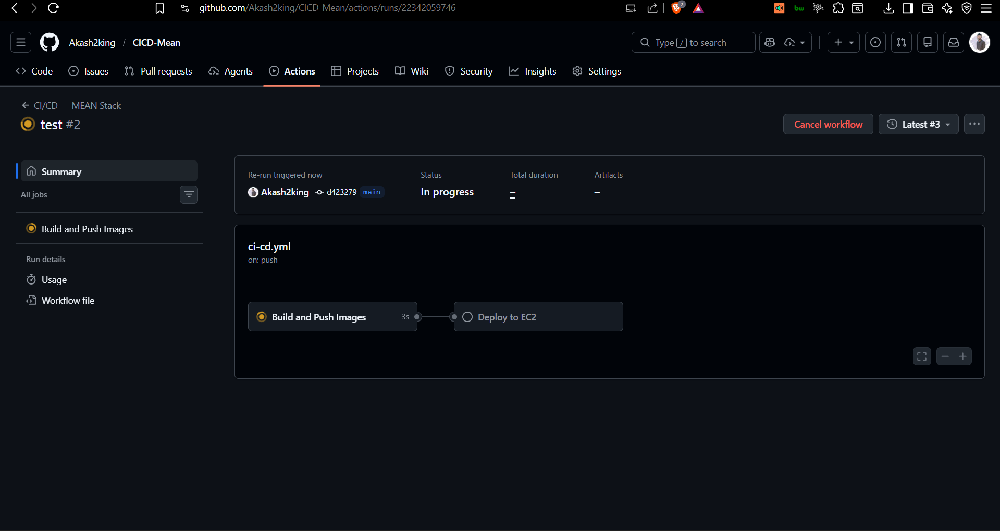

---

## 5. Step-by-Step: Docker Hub Setup

### Step 1 — Create a Docker Hub account

Go to [https://hub.docker.com](https://hub.docker.com) and sign up (free).


### Step 2 — Create two repositories

1. Click **Repositories** → **Create Repository**
2. Name: `mean-backend` → Visibility: **Public** → **Create**
3. Repeat → Name: `mean-frontend` → Visibility: **Public** → **Create**

You will now have:
- `your-username/mean-backend`
- `your-username/mean-frontend`

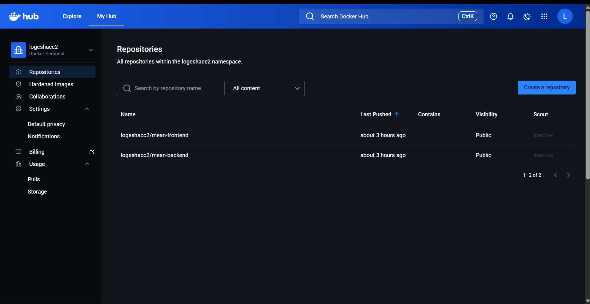

### Step 3 — Create an Access Token

> Never use your Docker Hub password in GitHub Actions — always use a token.

1. Click your profile picture → **Account Settings**
2. Click **Security** → **New Access Token**
3. Name: `github-actions`
4. Permissions: **Read, Write, Delete**
5. Click **Generate**
6. **Copy the token immediately** — you cannot see it again

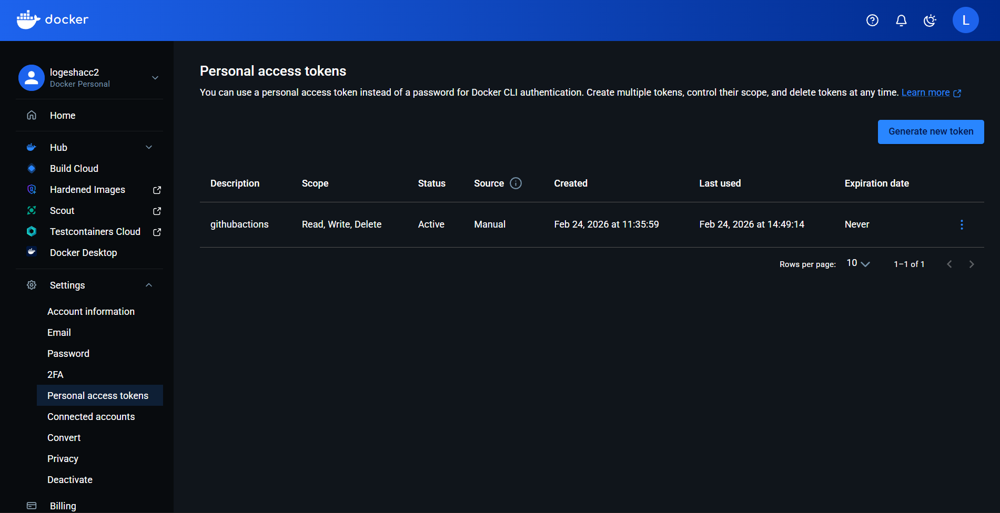

---

## 6. Step-by-Step: AWS EC2 Setup

### Step 1 — Launch an EC2 instance

1. Go to **AWS Console** → **EC2** → **Launch Instance**
2. Name: `mean-stack-server`
3. AMI: **Ubuntu Server 22.04 LTS**
4. Instance type: `t3.small` (needs at least 2 GB RAM for MongoDB)
5. Key pair: **Create new key pair** → Download the `.pem` file → keep it safe
6. Network settings → **Allow SSH (port 22)** from your IP
7. Network settings → **Allow HTTP (port 80)** from anywhere (`0.0.0.0/0`)
8. Click **Launch Instance**

### Step 2 — Connect to the EC2 instance

On Windows (PowerShell):

```powershell
ssh -i "your-key.pem" ubuntu@my-ec2-public-ip
```


### Step 3 — Run the setup script

Once connected to EC2, run:

```bash
curl -fsSL https://raw.githubusercontent.com/Akash2king/CICD-Mean/main/scripts/setup-ec2.sh | bash
```

This installs Docker, Docker Compose, AWS CLI, and creates the `~/app` directory.

### Step 4 — Log out and back in

Required for Docker to work without `sudo`:

```bash
exit
ssh -i "your-key.pem" ubuntu@your-ec2-public-ip
```

### Step 5 — Verify Docker is installed

```bash
docker --version
docker compose version
```

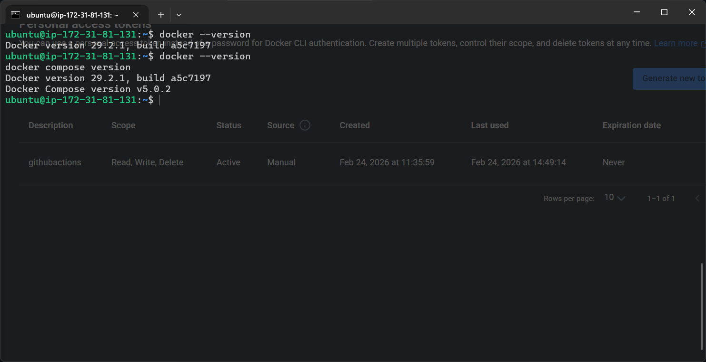

---

## 7. Step-by-Step: GitHub Secrets Setup

These secrets are encrypted and injected into the pipeline at runtime. They are **never visible** in logs.

### Step 1 — Go to repository secrets

1. Open your GitHub repository
2. Click **Settings** → **Secrets and variables** → **Actions**
3. Click **New repository secret** for each secret below

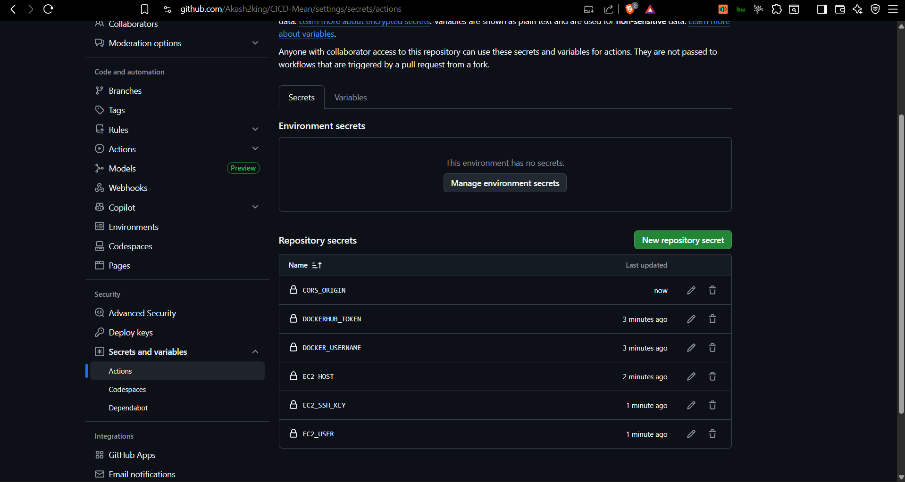

### Step 2 — Add all 7 secrets

| Secret Name | Value | Where to get it |
|---|---|---|
| `DOCKERHUB_USERNAME` | Your Docker Hub username | Your Docker Hub login name |
| `DOCKERHUB_TOKEN` | The access token from Step 5.3 | Docker Hub → Account Settings → Security |
| `EC2_HOST` | Your EC2 public IP | AWS Console → EC2 → Instances → Public IPv4 address |
| `EC2_USER` | `ubuntu` | Default username for Ubuntu AMI |
| `EC2_SSH_KEY` | Full contents of your `.pem` file | Open `.pem` in Notepad, copy everything including the `-----BEGIN` and `-----END` lines |
| `MONGO_URI` | `mongodb://mongo:27017/dd_db` | Use as-is for self-hosted MongoDB on EC2 |
| `CORS_ORIGIN` | `http://your-ec2-public-ip` | Your EC2 public IP with `http://` prefix, no trailing slash |

### Step 3 — Confirm all 7 secrets are listed

You should see all 7 names listed (values are always hidden).


---

## 8. Step-by-Step: Push Code and Trigger Pipeline

### Step 1 — Initialize git (if not done yet)

```bash
git init
git add .
git commit -m "Initial commit"
```

### Step 2 — Connect to GitHub and push

```bash
git remote add origin https://github.com/Akash2king/CICD-Mean.git
git branch -M main
git push -u origin main
```

### Step 3 — Watch the pipeline

1. Go to your GitHub repository
2. Click the **Actions** tab
3. Click **CI/CD — MEAN Stack** to open the running pipeline
4. Click each job to see live logs


### Step 4 — What a successful run looks like

```
✅ Build and Push  — backend and frontend images pushed to Docker Hub
✅ Deploy to EC2   — containers restarted, old images cleaned up
```

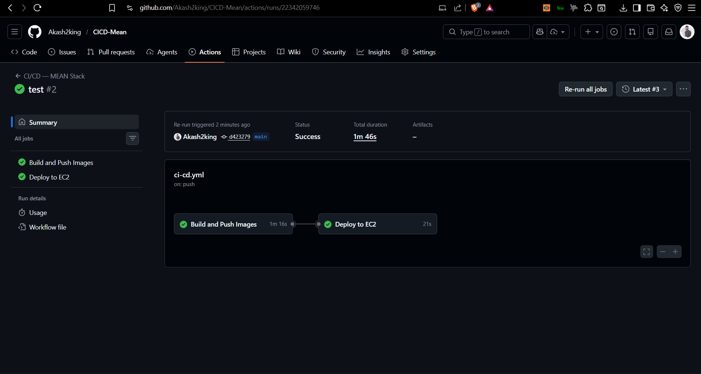

---

## 9. Verify Deployment

### Open the app in a browser

```
http://your-ec2-public-ip
```


### Check container status on EC2

SSH into EC2 and run:

```bash
cd ~/app
docker compose -f docker-compose.prod.yml ps
```

All 3 containers should show `running (healthy)`:

```
NAME        IMAGE                              STATUS
mongo       mongo:6.0                          running (healthy)
backend     your-username/mean-backend:latest  running (healthy)
frontend    your-username/mean-frontend:latest running (healthy)
```


### Test the backend API directly

```bash
curl http://localhost/api/
```

Expected response: `{"message":"Welcome to the Tutorials API."}`

### Check Docker Hub for pushed images

Go to `https://hub.docker.com/u/your-username` and you should see both images with a recent **Last pushed** timestamp.

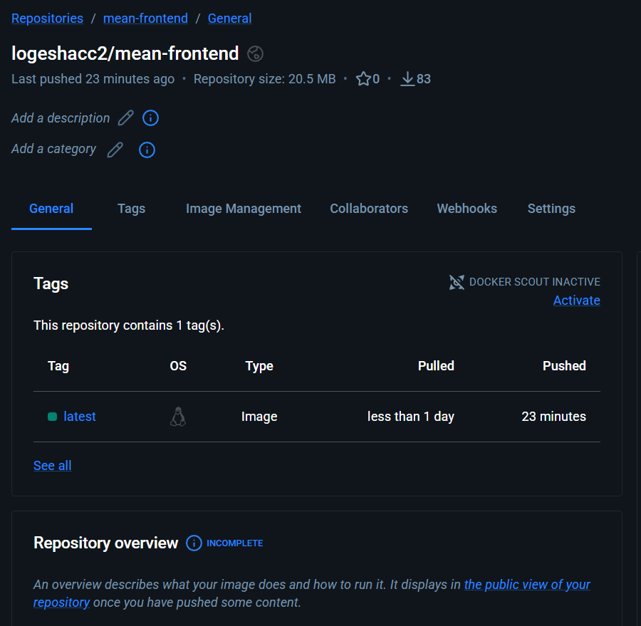

---

## 10. Memory & Performance Management

This is where the pipeline does more than just "build and ship." Every deliberate choice here reduces resource usage on the free-tier EC2 instance and makes the app faster for the user.

---

### Multi-Stage Docker Builds — Tiny Images, Faster Pulls

Both the backend and frontend use **multi-stage Dockerfiles**. The idea is simple: use a large image to build, then copy only what's needed into a small final image.

**Backend:**
- Stage 1 runs `npm ci --only=production` — installs only production dependencies, nothing for testing or dev tooling.
- Stage 2 starts from a slim Node.js base, copies only the installed `node_modules` and source code, and sets a non-root user.

**Frontend:**
- Stage 1 uses a full Node.js image to compile Angular with AOT (Ahead-of-Time) compilation — this pre-compiles templates so the browser doesn't have to.
- Stage 2 starts from `nginx:alpine` (a ~5 MB base) and only copies the compiled static files. The final image is around **30 MB** instead of the 1+ GB a development image would be.

Smaller images mean faster pulls from Docker Hub to EC2 on every deploy.

---

### Health Checks — No Traffic Before Ready

Every container in `docker-compose.prod.yml` has a `healthcheck` defined. Docker polls each container until it reports healthy before considering the stack up.

- **MongoDB** — pings itself with `mongosh --eval "db.adminCommand('ping')"`
- **Backend** — hits `http://localhost:8080/api/` and expects a 200 response
- **Frontend (Nginx)** — hits `http://localhost/` and expects a 200 response

This prevents a race condition where the backend starts up but MongoDB isn't ready yet, which would cause the first few API calls to fail on every cold deploy.

---

### Nginx Gzip Compression — Less Data Over the Wire

The `nginx.conf` enables gzip compression for all static assets and API responses:

```nginx
gzip on;
gzip_types text/plain text/css application/json application/javascript;
gzip_min_length 1024;
```

The compiled Angular bundle is large. With gzip enabled, it is compressed before being sent to the browser — typically reducing transfer size by 60–70%. This makes the initial page load noticeably faster, especially on slower connections.

---

### Log Rotation — Preventing Disk Full Crashes

Docker's default logging behavior writes container logs to files on disk indefinitely. On a free-tier EC2 instance, this can silently fill the disk within days, causing all containers to crash.

`docker-compose.prod.yml` configures log rotation on every container:

```yaml
logging:
  driver: "json-file"
  options:
    max-size: "10m"
    max-file: "3"
```

This caps each container's logs at 10 MB per file and keeps only the last 3 files — a maximum of 30 MB total per container. Old log files are automatically rotated out.

---

### Automatic Image Pruning — Keeping Disk Clean After Every Deploy

The last step in Job 2 of the pipeline runs:

```bash
docker image prune -a -f
```

Every deploy pulls fresh images from Docker Hub and leaves the old ones sitting on disk. On a small instance, even 3–4 deploy cycles can fill the disk with stale image layers. This command removes every image that isn't being used by a running container, immediately after the new containers are confirmed up. Disk stays clean automatically without manual intervention.

---

### npm ci — Reproducible Builds Every Time

The backend Dockerfile uses `npm ci` instead of `npm install`:

```dockerfile
RUN npm ci --only=production
```

`npm ci` installs the exact versions recorded in `package-lock.json` and fails if the lock file is missing or out of sync with `package.json`. This ensures every build on GitHub Actions produces the exact same `node_modules` as every other build — no version drift, no "it worked yesterday" surprises.

---

## 11. Project Files Explained

| File | What it does |
|---|---|
| `backend/Dockerfile` | Two-stage build: Stage 1 installs only production dependencies. Stage 2 creates a small image with a non-root user, tini for signal handling, and a health check. |
| `backend/package-lock.json` | Locks exact dependency versions. Required by `npm ci` inside Docker. Do not delete or add to `.gitignore`. |
| `frontend/Dockerfile` | Two-stage build: Stage 1 compiles Angular with AOT optimisation. Stage 2 serves the static files with Nginx (~30 MB final image). |
| `frontend/nginx.conf` | Serves Angular static files, proxies all `/api/*` requests to the backend container, enables gzip compression, sets security headers, handles Angular client-side routing. |
| `frontend/src/environments/environment.prod.ts` | API URL for production: `/api` (nginx proxies it to the backend container) |
| `docker-compose.prod.yml` | Production stack on EC2 — pulls images from Docker Hub, sets memory limits, configures health checks and log rotation. |
| `.env.example` | Template for environment variables. Copy to `.env` for local use. Never commit `.env`. |
| `.github/workflows/ci-cd.yml` | The CI/CD pipeline: Job 1 builds and pushes images to Docker Hub. Job 2 SSHs into EC2 and deploys. |
| `scripts/setup-ec2.sh` | One-time bootstrap script for a fresh EC2 instance — installs Docker, Docker Compose, and AWS CLI. |

---

## 12. Mistakes I Made — and How I Fixed Them

This section isn't just a dry troubleshooting guide. These are real mistakes I ran into while building and deploying this project for the first time. Each one taught me something I won't forget.

---

### "Invalid workflow file" — Secrets Don't Work Everywhere

After getting the build to pass, I tried to make the pipeline cleaner by referencing secrets at the top-level `env:` block in my workflow YAML — something like `CORS_ORIGIN: ${{ secrets.CORS_ORIGIN }}` outside of any job step.

GitHub Actions immediately flagged it as an **invalid workflow file**.

I didn't know this at the time, but GitHub Actions does **not** allow `${{ secrets.XXX }}` expressions outside of `steps:`. They are only resolved inside job steps. Moving the secret references inside the relevant `steps:` blocks fixed it entirely.

**Lesson:** GitHub Actions secrets have a scope. When in doubt, keep them inside `steps:`.

---

### Docker Hub Push Failed — Wrong Token Permissions

Once the workflow file was valid and the images were building, the push to Docker Hub failed. I had created a Docker Hub access token, added it as a secret, and assumed it would just work.

It didn't — because I had generated the token with **Read-only** permissions. The pipeline needs to push images, so the token must have **Read, Write, Delete** permissions.

I went back to Docker Hub, regenerated the token with the right permissions, updated the `DOCKERHUB_TOKEN` secret in GitHub, and the push worked on the next run.

**Lesson:** Pay attention to permission scopes when generating tokens. A read-only token will silently fail on push.

---


### EC2 Disk Full — Old Images Piling Up

After several pipeline runs, a deploy suddenly failed with a disk space error. The EC2 free-tier instance has limited storage, and every successful pipeline run was leaving behind old Docker images that were never cleaned up.

I ran these commands on the instance to reclaim space:

```bash
docker container prune -f
docker image prune -a -f
df -h /
```

That freed up several gigabytes instantly. I now make it a habit to prune periodically, and the pipeline also runs `docker image prune -a -f` automatically after every deploy.

**Lesson:** Docker images accumulate fast. On small instances, make image cleanup part of your routine — and automate it in the pipeline.

---
